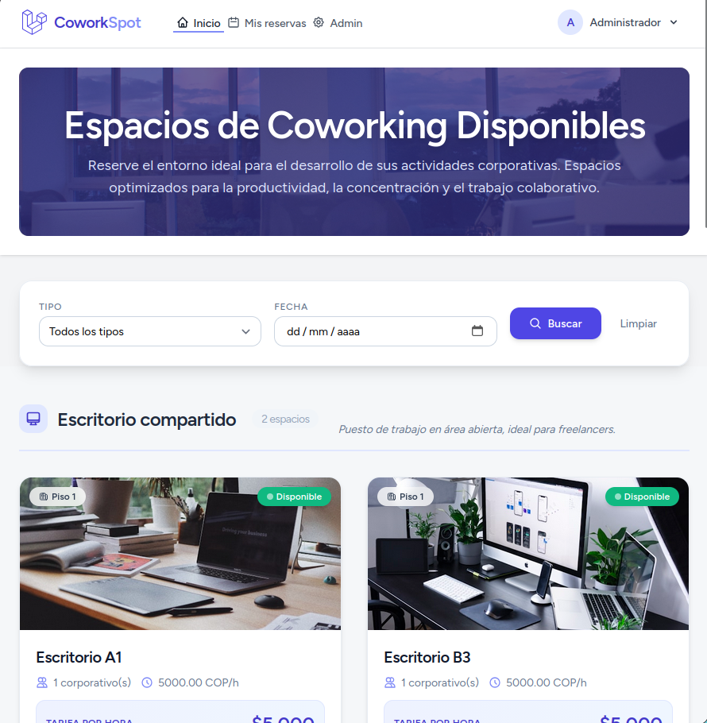
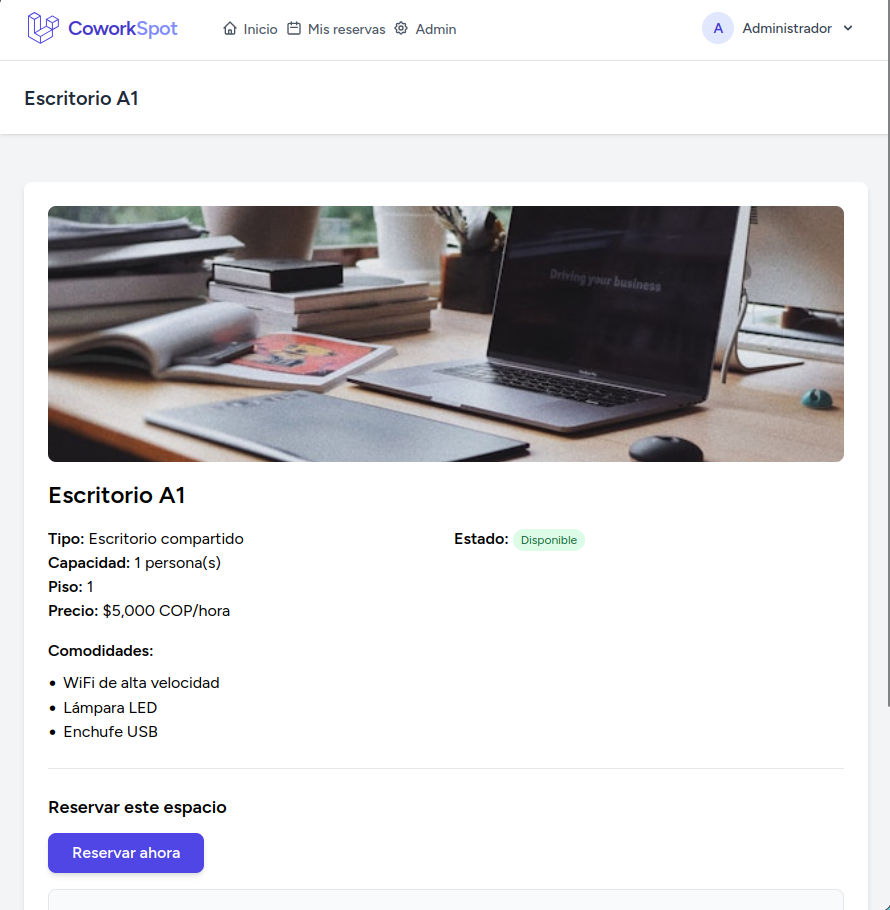
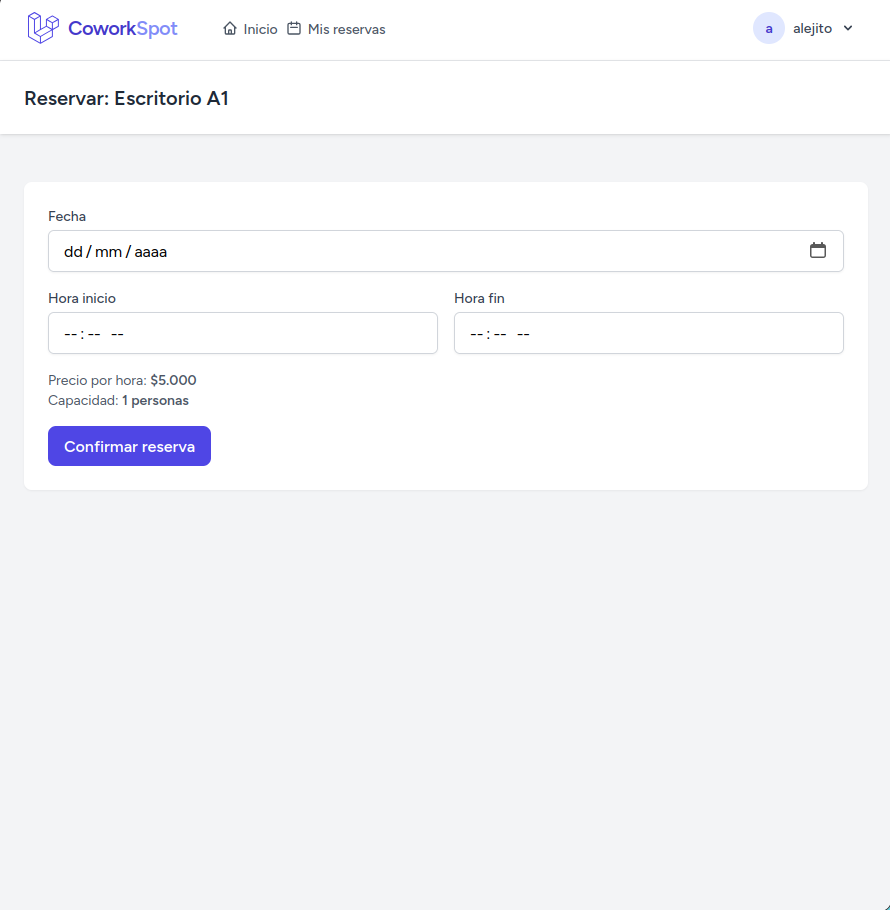
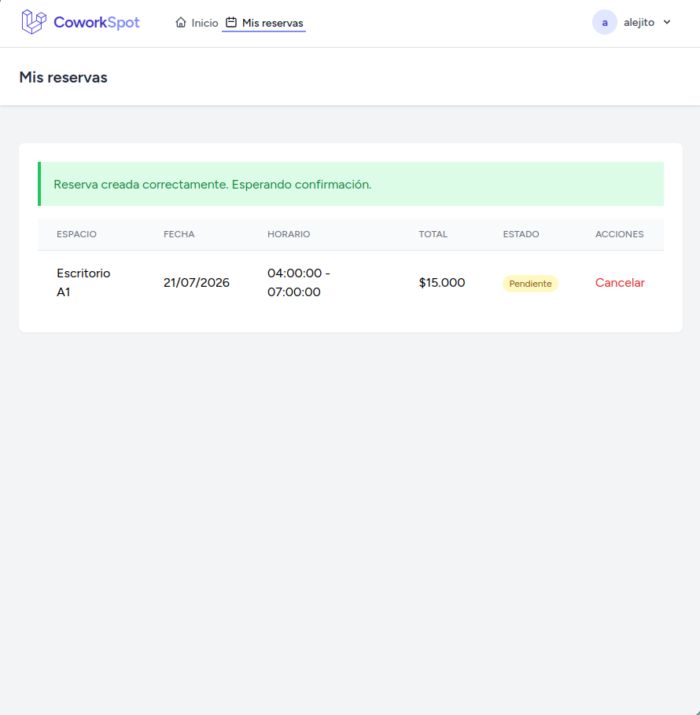
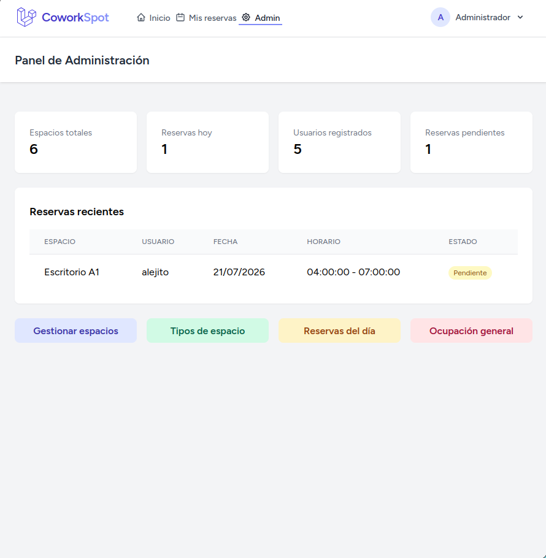

# CoworkSpot - Reserva de Espacios de Coworking

**Estudiante:** Alejandro Pereira Torres  
**Curso:** Desarrollo Web con Laravel  
**Fecha:** Julio 20 2026

---

## 📝 Descripción

CoworkSpot es una plataforma web que permite a los usuarios reservar espacios de coworking (escritorios, salas de reuniones u oficinas privadas) por horas o días. Los administradores gestionan los espacios, tipos de espacio, comodidades y controlan la ocupación en tiempo real.

---

## 🗄️ Tablas implementadas y relaciones

| **Tabla** | **Descripción** | **Relaciones** |
|-----------|-----------------|----------------|
| `users` | Usuarios del sistema (admin/member) | `hasMany(Reserva)` |
| `tipos_espacio` | Tipos de espacio (escritorio, sala, oficina) | `hasMany(Espacio)` |
| `espacios` | Espacios de coworking | `belongsTo(TipoEspacio)`, `hasMany(Reserva)`, `hasMany(Comodidad)` |
| `reservas` | Reservas de espacios | `belongsTo(Espacio)`, `belongsTo(User)` |
| `comodidades` | Servicios incluidos en cada espacio | `belongsTo(Espacio)` |

### Diagrama de relaciones

| Modelo Origen | Relación | Modelo Destino |
| :--- | :---: | :--- |
| **users** | hasMany | reservas |
| **tipos_espacio** | hasMany | espacios |
| **espacios** | hasMany | reservas |
| **espacios** | hasMany | comodidades |


---

## 🛠️ Instrucciones para correr localmente

### Requisitos previos
- PHP 8.3+
- Composer
- SQLite (o PostgreSQL/MySQL)
- Node.js (para Tailwind)

### Pasos

1. Clonar el repositorio
   bash
    git clone https://github.com/alejandropereira1/coworkspot.git
    cd coworkspot

2. Instalar dependencias de PHP
    bash
   composer install
   
3. Instalar dependencias de Node.js
   bash
   npm install
   npm run build
   
4. Configurar entorno
   bash
   cp .env.example .env
   php artisan key:generate
   
5. Configurar base de datos (SQLite)
   bash
   touch database/database.sqlite
   
6. Ejecutar migraciones y seeders
    bash
    php artisan migrate --seed
    
7. Iniciar servidor
    bash
    php artisan serve
    
8. Acceder a la aplicación en el navegador

    http://localhost:8000

## 🛠️ Tecnologías utilizadas

- **Framework**: Laravel 13
- **Base de datos**: SQLite (desarrollo), PostgreSQL (producción)
- **Frontend**: Blade + Tailwind CSS
- **Autenticación**: Laravel Breeze
- **Despliegue**: Railway
- **Testing**: PHPUnit

## 📋 Requisitos funcionales

### Zona pública
- Listado de espacios por tipo con sus comodidades.
- Detalle del espacio con precio por hora y capacidad.
- Registro e inicio de sesión.

### Zona usuario
- Buscar disponibilidad por fecha.
- Reservar un espacio seleccionando fecha y horario.
- Ver mis reservas y su estado.
- Cancelar reserva con anticipación (>2 horas).

### Zona administrador
- CRUD de espacios, tipos de espacio y comodidades.
- Ver reservas del día.
- Confirmar o cancelar cualquier reserva.
- Ver ocupación general por espacio.

### Lógica de negocio
- No se permiten solapamientos de reservas en el mismo espacio y horario.
- El precio total se calcula automáticamente: `(end_time - start_time) * price_per_hour`.
- Solo el dueño puede cancelar su reserva (con >2h de anticipación).
- Un administrador puede cancelar cualquier reserva en cualquier momento.

  Despliegue en Railway

La aplicación está disponible en:

🔗 https://coworkspot.shop

Credenciales de administrador:

    Email: admin@coworkspot.com

    Contraseña: password123
--------------------------------------------------------------------------------------------------

## 🧪 Tests

Se implementaron pruebas unitarias y funcionales para validar:
- Autenticación (registro, login, logout).
- CRUD de espacios y tipos (admin).
- Lógica de reservas (creación, solapamiento, cancelación con anticipación).
- Roles y permisos (admin vs member).

```bash
php artisan test --filter="AuthTest|AdminTest|EspacioTest|ReservaTest"

-------------------------------------------------------------------------------------------------

## 📸 Capturas de pantalla

### 1. Página de inicio


### 2. Detalle de espacio


### 3. Formulario de reserva


### 4. Mis reservas


### 5. Panel de administración


### 6. Tests pasando

